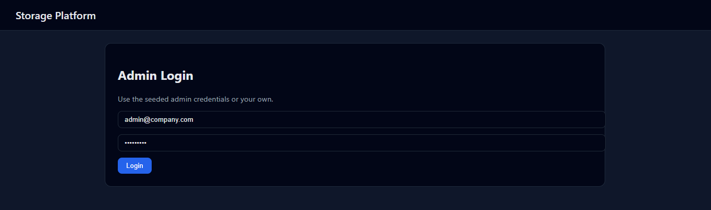
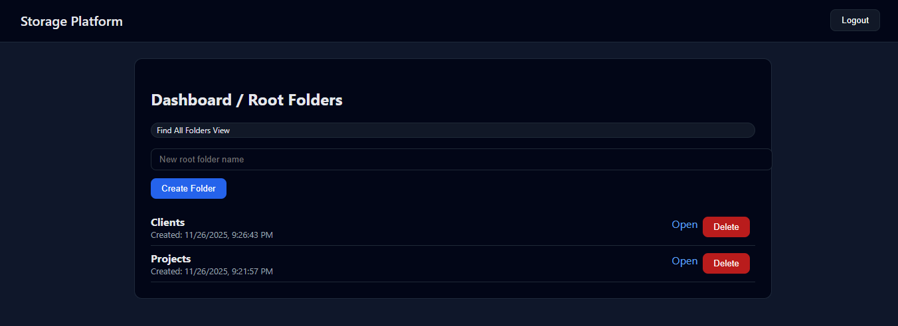

# 📦 Storage Platform — Full Stack Assignment

A simplified internal **Storage Platform (Drive-like System)** built using the **MERN Stack**.  
This application allows an **Admin** to manage folders & files and generate **public read-only share links**.

---

## 🚀 Tech Stack

### Frontend
- React
- TypeScript
- CSS (Custom responsive UI)
- Axios

### Backend
- Node.js
- Express.js
- MongoDB (Mongoose)
- JWT Authentication

### Deployment
- Frontend: **Vercel**
- Backend: **Render**
- Database: **MongoDB Atlas**

---

## 👥 User Roles

### ✅ Admin (Authenticated)
- Login with email & password
- Create root folders
- Create sub-folders
- Upload files (metadata)
- Rename & delete folders/files
- Generate & revoke public share links

### ✅ Public User (Unauthenticated)
- Access shared files/folders using **public share URL**
- Read-only access
- No login required

---

## 📂 Features Implemented

### 🔐 Authentication
- JWT based login
- Secure protected routes
- Admin seeding supported

### 📁 Folder Management
- Create root folders
- Create nested sub-folders
- Rename folders
- Delete folders with cascading delete
- Navigate folder structure

### 📄 File Management
- Add file metadata with dummy URL
- Rename files
- Delete files

### 🔗 Public Share Links
- Generate unique public URLs
- Revoke shared links
- Public read-only view

### 📱 Responsive UI
- Fully responsive for:
  - Desktop
  - Tablet
  - Mobile

---

## 🔗 Live URLs

| Service | URL |
|--------|-----|
| Frontend | https://storage-app-ashen.vercel.app |
| Backend | https://storageapp-qkdb.onrender.com |

---

## 🔑 Default Admin Credentials

PORT=5000
MONGO_URI=<your_mongodb_connection_string>
JWT_SECRET=supersecret_jwt_key_123


---

## ⚙️ Backend Setup (Local)

```bash
cd backend
npm install
npm start

Seed Admin:
```
POST /api/auth/seed-admin

### ⚙️ Frontend Setup (Local)
- cd frontend
- npm install
- npm start

## 📌 API Endpoints Overview

### Auth

- POST /api/auth/login
- POST /api/auth/seed-admin

  ### Folders
   - GET /api/folders/root
   - GET /api/folders/:id
   - POST /api/folders
   - PATCH /api/folders/:id
   - DELETE /api/folders/:id
   - POST /api/folders/:id/share
   - PATCH /api/folders/share/:shareId/revoke
 
  ### Files

 - POST /api/files
 - PATCH /api/files/:id
 - DELETE /api/files/:id
 - POST /api/files/:id/share

   ### Public

   - GET /api/public/:shareId
  
   ### ✅ Security Features

   - JWT Authentication
   - Password hashing with bcrypt
   - Protected API routes
   - Token-based access control
   - Public routes strictly read-only
  
   ## 📄 Project Structure

```
storageApp/
│
├── backend/
│   ├── config/
│   ├── controllers/
│   ├── middleware/
│   ├── models/
│   ├── routes/
│   ├── server.js
│
├── frontend/
│   ├── src/
│   │   ├── api/
│   │   ├── pages/
│   │   ├── App.tsx
│   │   ├── index.tsx
│   └── styles.css
│
└── README.md

```
### 📌 Assignment Requirements Covered

- ✅ Admin authentication
- ✅ Dashboard with root folders
- ✅ Sub-folder navigation
- ✅ Nested folder structure
- ✅ File operations
- ✅ Public share view
- ✅ Backend APIs
- ✅ MongoDB database
- ✅ Responsive UI
- ✅ Proper error handling

### 🧑‍💻 Developer

- Name: Venkatesh Karthan
- Role: Full Stack Developer (MERN)
- Project Type: Assignment / Portfolio Project

---

## 🖼️ Application Screenshots

> Below are the key screens of the Storage Platform application.

### 🔐 Admin Login


### 📊 Dashboard – Root Folders


### 📁 Nested Folder View


---


